# PROJECT Design Documentation

> _The following template provides the headings for your Design
> Documentation.  As you edit each section make sure you remove these
> commentary 'blockquotes'; the lines that start with a > character
> and appear in the generated PDF in italics but do so only **after** all team members agree that the requirements for that section and current Sprint have been met. **Do not** delete future Sprint expectations._

## Team Information
* Team name: Getting it Done
* Team members
  * Brock Weiler
  * Daniel Catorcini
  * Matthew Spring
  * Alec Vuillermoz

## Executive Summary
UFundFood is a non-profit organization that seeks to distribute food and produce to food shelters and soup kitchens across the Tallahassee area, mainly for those who are affected by homelessness and severe weather that occurs. 

### Purpose
>  _**[Sprint 2 & 4]** Provide a very brief statement about the project and the most
> important user group and user goals._

The purpose of this project is to develop a user-friendly webpage that enables helpers to identify, select, and fund needs to support people affected by natural disasters. The primary user group, the helpers, can browse, add, and manage needs for funding through a streamlined interface. Their main goal is to easily view and contribute to various needs in a system that supports minimal authentication and ensures data persistence.

### Glossary and Acronyms
> _**[Sprint 2 & 4]** Provide a table of terms and acronyms._

| Term |           Definition             |
|------|----------------------------------|
| SPA  | Single Page                      |
| REST | Representational State Transfer  |
| API  | Application Programming Interface|
| CRUD | Create, Read, Update, Delete     |
| DAO  | Data Access Object               |
| MVC  | Model-View-Controller            | 

## Requirements

This section describes the features of the application.

> _In this section you do not need to be exhaustive and list every
> story.  Focus on top-level features from the Vision document and
> maybe Epics and critical Stories._

User Authentication: Users being able to create an account, users being able login, admin login, and logout.

Need Management: Allow admin to add need, helper can view and add needs to their basket

Users: helpers can add and remove a need from their cart. They can also search for a need.

Leaderboard: Lists the top 10 users by their amount spent on products. 

Filter: Able to filter the needs by multiple conditions at once to find specific qualities.

Persistence: Stores the users information in json files

### Definition of MVP
> _**[Sprint 2 & 4]** Provide a simple description of the Minimum Viable Product._

The Minimum Viable Product (MVP) for our project is a streamlined version of the application that includes essential features necessary for user interaction and core functionality. The MVP focuses on enabling users to authenticate their accounts, manage needs, and interact with their baskets efficiently.

### MVP Features
>  _**[Sprint 4]** Provide a list of top-level Epics and/or Stories of the MVP._

AS a Developer I WANT to submit a request to create a new need (name [unique], cost, quantity, type, category) SO THAT it is added to the cupboard.

AS a Developer I WANT to submit a request to get the the needs in the cupboard whose name contains the given text, SO THAT I have access to only that subset of needs.

AS a USER I WANT to buy the needs in my basket TO help support the people affected by natural disasters.

AS a helper I WANT to select a need from the cupboard and add it to the basket to be bought

### Enhancements
> _**[Sprint 4]** Describe what enhancements you have implemented for the project._

Leaderboard: We implemented a leaderboard feature that displays the top 10 highest spenders on the website. This feature highlights the biggest contributors, offering a way for users to see how much they have donated in comparison to others. The leaderboard encourages engagement by recognizing top donors and celebrating their impact.

Filters: We implemented a multi-filter functionality that allows users to apply multiple filters simultaneously to refine their search for needs with specific criteria. Users can filter by category—such as beverages, perishables, and produce—as well as by cost and quantity needed, enabling them to efficiently locate needs that match their exact requirements.

## Application Domain

This section describes the application domain.

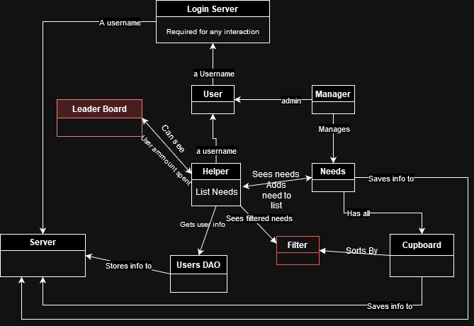

> _**[Sprint 2 & 4]** Provide a high-level overview of the domain for this application. You can discuss the more important domain entities and their relationship
> to each other._

The application domain for our project, UFunds, centers on the management of needs and resources for Helpers. The domain model illustrates the primary entities and their relationships, offering a clear framework for understanding user interactions within the system.

User to Need: A user’s need list, or "Basket," can contain multiple Needs, establishing a one-to-many relationship. This structure allows Helpers to organize and manage the resources they wish to fund.

User to Basket: Each user is associated with a single "Basket," creating a one-to-one relationship. This ensures that Helpers maintain a dedicated and organized list of selected Needs.

Admins and Needs: Admins can independently manage Needs, providing essential oversight and control for updating the inventory of available resources.

Basket to Cupboard: Upon checkout, the quantity of items in the Basket is deducted from the corresponding Need in the Cupboard, ensuring that available resources accurately reflect funded contributions.

## Architecture and Design

This section describes the application architecture.

### Summary

The following Tiers/Layers model shows a high-level view of the webapp's architecture. 
**NOTE**: detailed diagrams are required in later sections of this document.
> _**[Sprint 1]** (Augment this diagram with your **own** rendition and representations of sample system classes, placing them into the appropriate M/V/VM (orange rectangle) tier section. Focus on what is currently required to support **Sprint 1 - Demo requirements**. Make sure to describe your design choices in the corresponding _**Tier Section**_ and also in the _**OO Design Principles**_ section below.)_

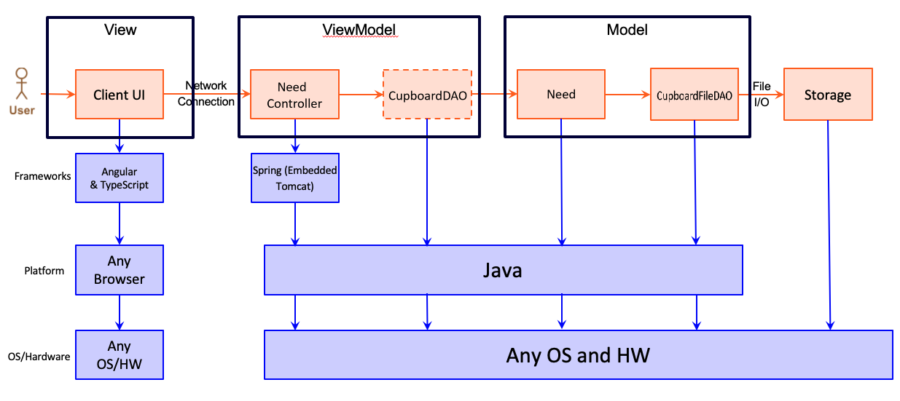

The web application, is built using the Model–View–ViewModel (MVVM) architecture pattern. 

The Model stores the application data objects including any functionality to provide persistence. 

The View is the client-side SPA built with Angular utilizing HTML, CSS and TypeScript. The ViewModel provides RESTful APIs to the client (View) as well as any logic required to manipulate the data objects from the Model.

Both the ViewModel and Model are built using Java and Spring Framework. Details of the components within these tiers are supplied below.

### Overview of User Interface

This section describes the web interface flow; this is how the user views and interacts with the web application.

> _Provide a summary of the application's user interface.  Describe, from the user's perspective, the flow of the pages in the web application._

A user opens the webpage and is presented with a login/create user screen. They can select the appropriate button based on their situation to log in or create a new account. Once logged in, the user is directed to their dashboard, where they can search for available needs or choose from those already visible.

From the dashboard, users can access their basket to view the needs they have selected and remove any if necessary.

If an admin logs in, they are greeted with a different dashboard featuring fields to create new needs. Admins also have the ability to remove needs from the inventory entirely.

Both users and admins can easily log out of the service when they are finished.

### View Tier
> _**[Sprint 4]** Provide a summary of the View Tier UI of your architecture.
> Describe the types of components in the tier and describe their
> responsibilities.  This should be a narrative description, i.e. it has
> a flow or "story line" that the reader can follow._

The user begins by opening the webpage, which brings them to the Login Screen. Here, they have the option to either create a new account or log in to an existing one.
Once logged in, they are taken to the Needs Component, which displays a list of all available needs in the basket. This page includes:
  - A Needs Search Component, where users can search for specific items.
  - A Sidebar Filter with options to narrow down the displayed items based on selected criteria.
  - A Checkout button to view their needs in the basket
  - A Leaderboard button to view the top 10 users with the most money spent on the website
  - A Sign out button to log the user out 
If the user wants to filter the displayed needs, they click the Filter Button in the sidebar. This opens a selection of filter criteria, allowing the user to refine their view based on factors like category, price range, or availability. Alternatively, if they want to look for a particular need, they can type keywords into the Search Bar. Matching items will appear, and the user can click on a specific need to view more details. Clicking on a need brings the user to the Need Detail Page, which displays in-depth information about the selected item. If the user decides to add this item to their basket, they can click the Add to Basket button. The user can then view their selected items by clicking on the Shopping Cart Icon, which opens a summary of all items in their basket, along with quantities for each item.
When ready to purchase, they click the Checkout Button, which leads to the Checkout Page. Here, they can:
  - Review the items in their basket.
  - Adjust quantities as desired.
  - Remove needs from their basket
  - See the total cost based on current selections.

> _**[Sprint 4]** You must provide at least **2 sequence diagrams** as is relevant to a particular aspects 
> of the design that you are describing.  (**For example**, in a shopping experience application you might create a 
> sequence diagram of a customer searching for an item and adding to their cart.)
> As these can span multiple tiers, be sure to include an relevant HTTP requests from the client-side to the server-side 
> to help illustrate the end-to-end flow._

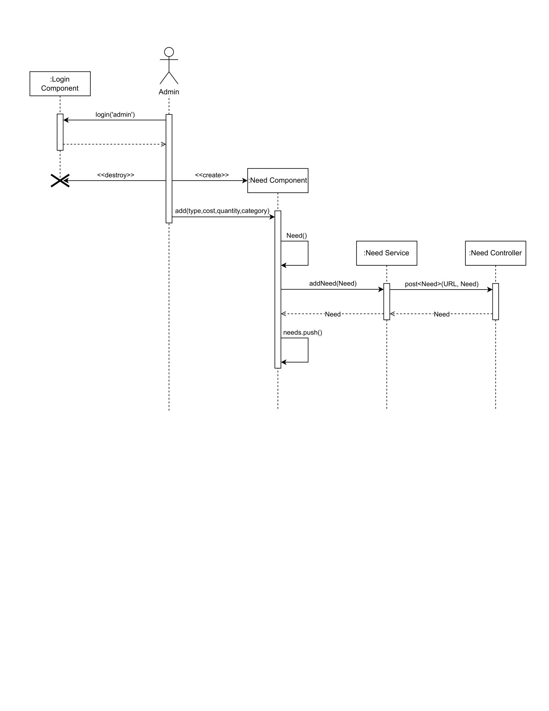

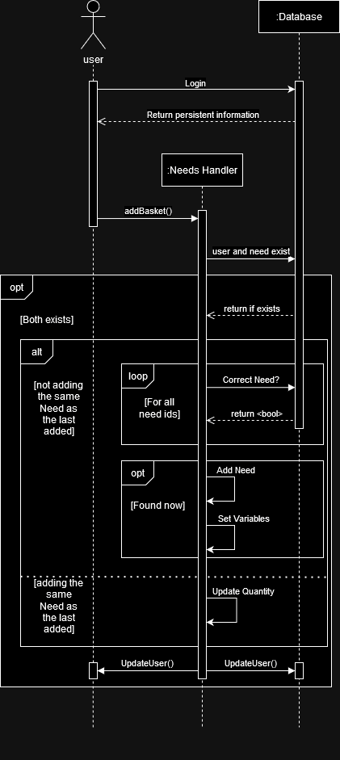

> _**[Sprint 4]** To adequately show your system, you will need to present the **class diagrams** where relevant in your design. Some additional tips:_
 >* _Class diagrams only apply to the **ViewModel** and **Model** Tier_
>* _A single class diagram of the entire system will not be effective. You may start with one, but will be need to break it down into smaller sections to account for requirements of each of the Tier static models below._
 >* _Correct labeling of relationships with proper notation for the relationship type, multiplicities, and navigation information will be important._
 >* _Include other details such as attributes and method signatures that you think are needed to support the level of detail in your discussion._

### ViewModel Tier
> _**[Sprint 1]** List the classes supporting this tier and provide a description of there purpose._

NeedsController: An API that parses commands to provide full CRUD support for the user. This is directly supported by an implementation of the CupboardDAO interface

CupboardDAO: an interface that allows us to control the information from persistence from whatever source we choose. Used by NeedsController to limit the overall amount of refactoring needed if the database is changed. References Need class

UserController: A REST API that handles CRUD operations for user management. It provides endpoints to create, retrieve, update, and delete user records, enabling user interactions through a well-defined interface. It utilizes the UserFileDAO for persistence operations.

UserFileDAO: Implements the UserDAO interface to provide file-based persistence for user data in JSON format. This class is responsible for loading and saving user information, allowing the application to read and write user records while abstracting the file operations from the UserController. It facilitates data manipulation and storage without being tied to a specific database implementation.

> _**[Sprint 4]** Provide a summary of this tier of your architecture. This
> section will follow the same instructions that are given for the View
> Tier above._

When the user lands on the login page and decides to create an account the UserController handles this by creating the new user and then the 
UserFileDAO will then save this new user in JSON format. They will then be on the needs page where all the needs are displayed and if they decide to add 
a need to their basket the UserController will then add it to their basket. Then the UserFileDAO will either create or update their basket data in the
JSON file. The User decides to checkout so then the UserController clears the basket and updates their amount spent field, and the UserFileDAO clear the data 
inside the JSON file. The CupboardDAO also removes the same amount of items that were checkout from the user to decrease the amount of needs needed.
When an admin logs into their account they can add, remove, and edit any existing needs and this is handled by the NeedsController and CupboardDAO 
to update the needs data in the Cupboard.

> _At appropriate places as part of this narrative provide **one** or more updated and **properly labeled**
> static models (UML class diagrams) with some details such as associations (connections) between classes, and critical attributes and methods. (**Be sure** to revisit the Static **UML Review Sheet** to ensure your class diagrams are using correct format and syntax.)_
> 
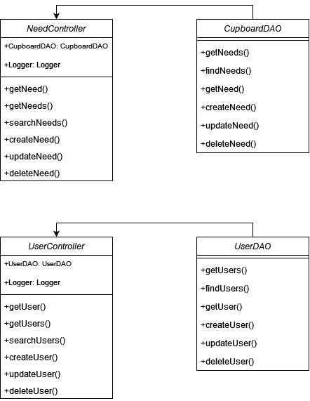

### Model Tier
> _**[Sprint 1]** List the classes supporting this tier and provide a description of there purpose._

Need: the actual item needed, consisting of an **id**, a **type**, **cost**, and **quantity**. It is an implementation of the information found in ./ufund-api/Needs.json

CupboardFileDAO: an implementation of CupboardDAO. Specifically made to create and keep persistence in files and directly interacts with ./ufund-api/Needs.json

User: Represents a user of the application, containing attributes such as **id**, **name**, **needList** (a list of need IDs), **quantity** (how many of each need the user has), and **spent** (the total amount spent by the user). This class enables the management of individual user information and their interactions with the needs available in the application.

UserFileDAO: an implementation of UserFileDAO. Made to keep and create persistence in files with user information.

> _**[Sprint 2, 3 & 4]** Provide a summary of this tier of your architecture. This
> section will follow the same instructions that are given for the View
> Tier above._

The Model Tier encapsulates the core data structures and persistence mechanisms used by the application. It consists of the Need, User, and CupboardFileDAO classes, which work together to manage the application's state and data.

The Need class defines the properties and characteristics of items that users may require, including their identifiers, types, costs, and available quantities.

The User class maintains individual user profiles, including their associated needs and financial transactions, enabling personalized experiences and interactions within the application.

The CupboardFileDAO class handles the file-based persistence of need data, ensuring that changes to the needs are saved and retrieved correctly from the designated JSON file.

The UserFileDAO class handles the file-based persistence of user data, ensuring that changes made to the users are saved and retrieved correctly from the designated JSON file.

Overall, this tier serves as the foundation for data management, ensuring that both needs and users are represented accurately and can be manipulated as required by the application's business logic.

> _At appropriate places as part of this narrative provide **one** or more updated and **properly labeled**
> static models (UML class diagrams) with some details such as associations (connections) between classes, and critical attributes and methods. (**Be sure** to revisit the Static **UML Review Sheet** to ensure your class diagrams are using correct format and syntax.)_
> 
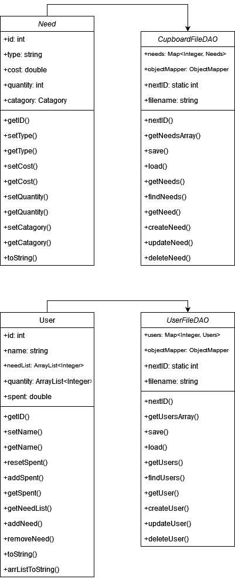

## OO Design Principles

> _**[Sprint 1]** Name and describe the initial OO Principles that your team has considered in support of your design (and implementation) for this first Sprint._

We are using a basic Need Class to reference all information from persistence in an easy and organized way. We are also using the CupboardDAO interface (implemented through CupboardFileDAO and referenced in NeedController) to quickly be able to separate the front-end code from the back-end code so that they can be changed and interacted with individually.

> _**[Sprint 2, 3 & 4]** Will eventually address upto **4 key OO Principles** in your final design. Follow guidance in augmenting those completed in previous Sprints as indicated to you by instructor. Be sure to include any diagrams (or clearly refer to ones elsewhere in your Tier sections above) to support your claims._

Single Responsibility Principle (SRP): Each class in the Model Tier has a single responsibility.
- Need: Manages need-related data (id, type, cost, quantity).
- User: Manages user-related data (user ID, name, need list, quantity, spent).
- CupboardFileDAO: Handles file-based data persistence for needs.
This separation of concerns simplifies the codebase, making it easier to maintain and evolve over time.

Low Coupling (GRASP): The classes in the Model Tier are designed with low coupling, meaning they are independent and interact minimally with each other.
For example, the User class interacts with Need and CupboardFileDAO without depending on their internal implementations. This promotes modularity and makes it easier to modify or replace components without affecting the entire system.

The open/closed principle: this principle states that classes we create should be open to extension, but closed for modification. What this means is that we should always be allowed to enter new code into the classes, but will be closed and immutable when accessed by other programs in the same system. Our methods in the model tier follow this principle very well. We are able to add new methods or variables at any time to any of the files, but the code files that exist in the model tier aren't able to have their methods or declaration statements changed.

The Controller principle: assigns the responsibility of handling system events to a controller class. It serves as the bridge between the front end and the back end. When a user action triggers a request (such as creating, updating, retrieving, or deleting data), the front end calls the controller. The controller processes these requests by delegating tasks to the appropriate backend components. Once the backend operations are completed, the controller may return responses to update the front end, ensuring seamless communication and functionality.

> _**[Sprint 3 & 4]** OO Design Principles should span across **all tiers.**_

## Static Code Analysis/Future Design Improvements
> _**[Sprint 4]** With the results from the Static Code Analysis exercise, 
> **Identify 3-4** areas within your code that have been flagged by the Static Code 
> Analysis Tool (SonarQube) and provide your analysis and recommendations.  
> Include any relevant screenshot(s) with each area._

When looking at the code scanned by Sonarqube, we happy to see that while there where issues, none of them were that serious as to causes crashes or erros in the program, as most were mantainability issues.

Issue 1: Member 'userService: UserService' is never reassigned; mark it as `readonly`
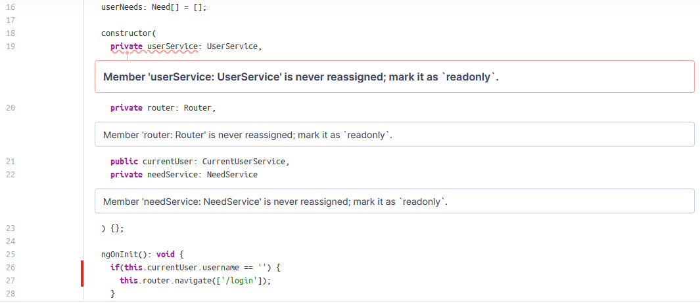
This issue is about declaring the variable UserService. Since it is never edited, Sonarqube tells us to declare it as readonly, Which makes sense. We then make this change to the code.

Issue 2: Unexpected var, use let or const instead.
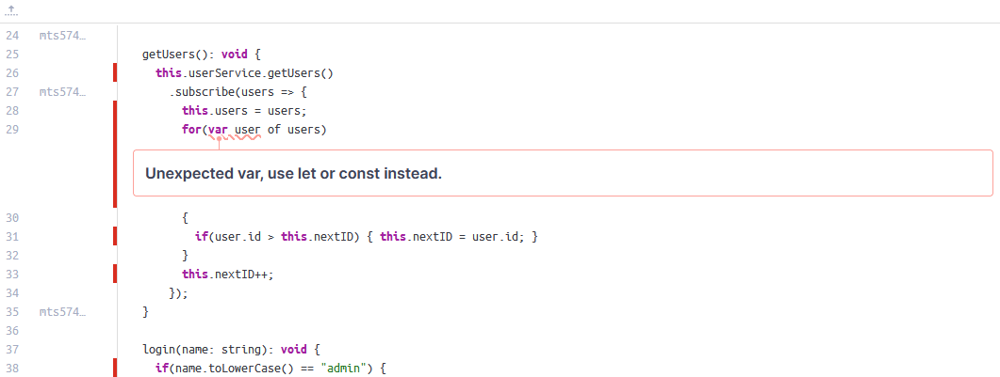
This issue is also pretty simple. Because of the way typescript functions, using the keyword Let instead of var allows for only block scoped variables. if "var" was used instead, the variable would be able to be accessed through the entire function instead of just the for loop.

Issue 3: router.mjs' imported multiple times.
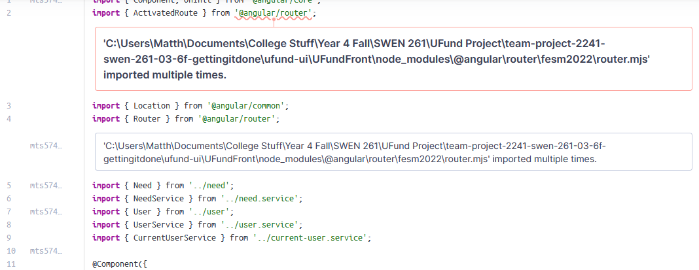
Another simple error. This is caused because the router component is inputted multiple times, despite only needed to do that once.

> _**[Sprint 4]** Discuss **future** refactoring and other design improvements your team would explore if the team had additional time._

If our team had additional time, we would do a couple of things. For starters, while we like our UI, it could be so much better. We would use the additional time to make the pages on our site look much more refined and elegant. Adding a top bar, and better location for buttons would be on the top of that list.

As for actual functionallity, We are pretty happy with how things are, though there are some methods/code we never figured out how to get working, and took a "detour" around it, writing less efficent code that accomplishes the same thing. If we had additional time, we would want to fix this code and accomplish the tasks the "right" way. 

## Testing
> _This section will provide information about the testing performed
> and the results of the testing._

### Acceptance Testing
> _**[Sprint 2 & 4]** Report on the number of user stories that have passed all their
> acceptance criteria tests, the number that have some acceptance
> criteria tests failing, and the number of user stories that
> have not had any testing yet. Highlight the issues found during
> acceptance testing and if there are any concerns._

Total User Stories: 15
User Stories Passed All Acceptance Criteria: 15
User Stories with Some Acceptance Criteria Failing: 0
User Stories Not Tested Yet: 0

Issues Found During Acceptance Testing

No issues were identified during the acceptance testing phase for the user stories that have been tested.
Concerns

As all user stories have successfully passed their acceptance criteria, there are currently no major concerns to report.

### Unit Testing and Code Coverage
> _**[Sprint 4]** Discuss your unit testing strategy. Report on the code coverage
> achieved from unit testing of the code base. Discuss the team's
> coverage targets, why you selected those values, and how well your
> code coverage met your targets._

So our unit testing strategy was to write tests for all the possible ways a function or method could go through til they all passed for a class. We would work our way
through files making sure that each function ran as expected so we could continue to develop on reliable code. When we were introduced to jacoco we would check our tests to see
if they covered our tests as we expected them too. If they did not we would go back and edit our tests. Our teams code coverage target was at least 90% because thats we we needed for full credit but also 100% on the model tier because its fairly simple methods. Our code coverage from sprint 4 was 95% so we met and exceeded our target goals for our code coverage.

>_**[Sprint 2, 3 & 4]** **Include images of your code coverage report.** If there are any anomalies, discuss those._

Sprint 2:
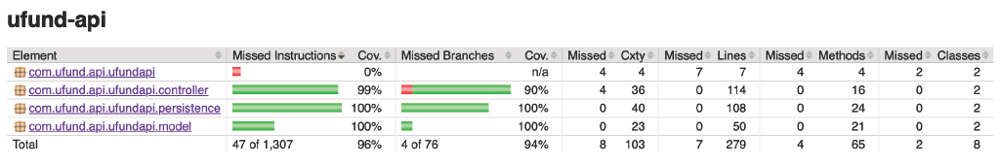

Sprint 3:
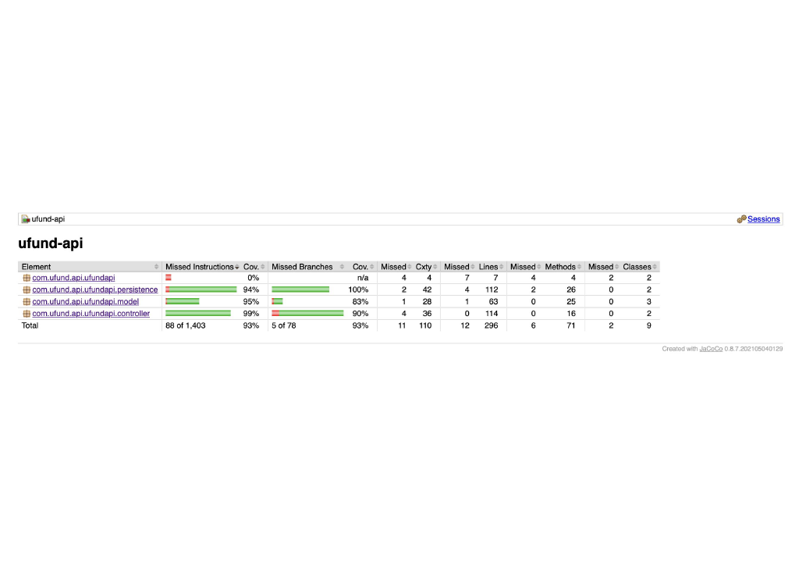

Sprint 4:
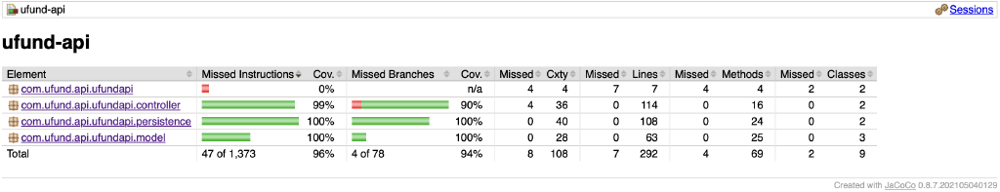

## Ongoing Rationale
>_**[Sprint 1, 2, 3 & 4]** Throughout the project, provide a time stamp **(yyyy/mm/dd): Sprint # and description** of any _**major**_ team decisions or design milestones/changes and corresponding justification._

(2024/10/01): Sprint 2 we decided to make another controller and implement it to work with files. As well as create a new model for users

(2024/10/03): Added all of the angular shell code to implement the front end for the MVP

(2024/10/16): Decided upon the enhancements that we wanted our software project to have.

(2024/10/30): Decided as a group what the UI would look like for the project.

(2024/11/11): Finalized Sprint 3 Deliverable

(2024/11/20): Finished Design Document updating in prep. for sprint 4.

(2024/11/25): Finished Powerpoint and Finalized Sprint 4 Deliverable
